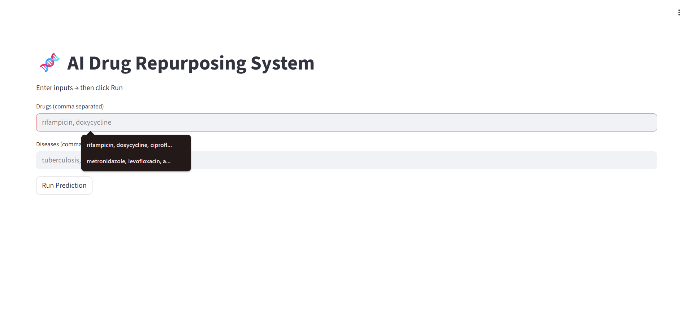
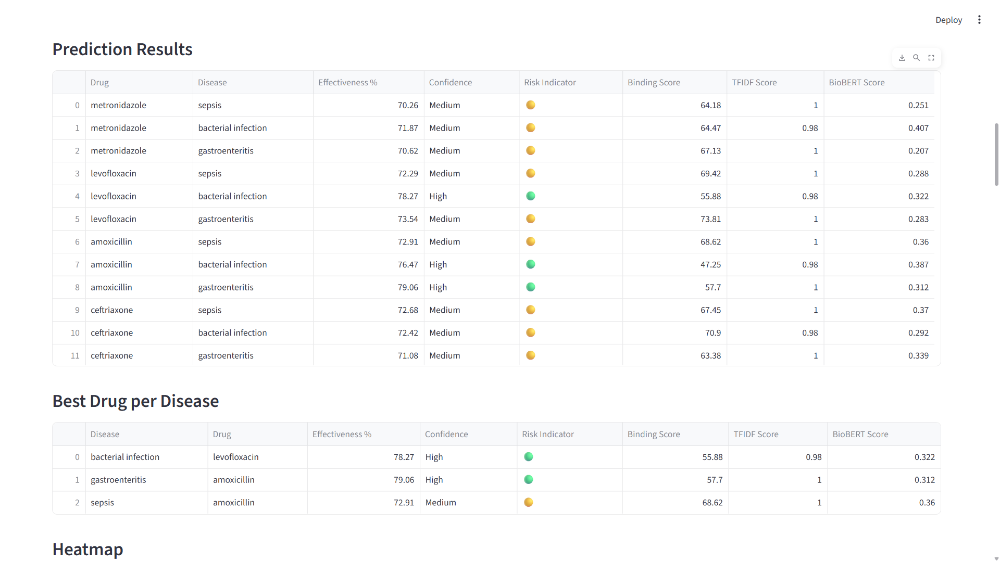
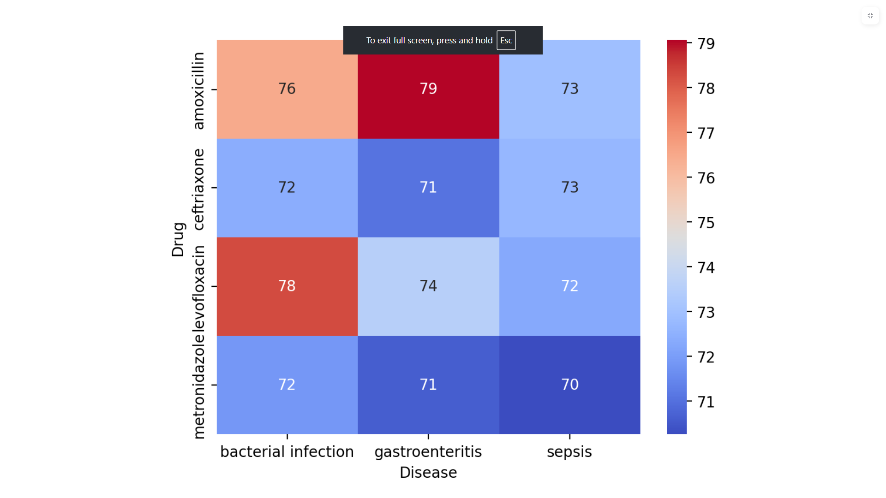
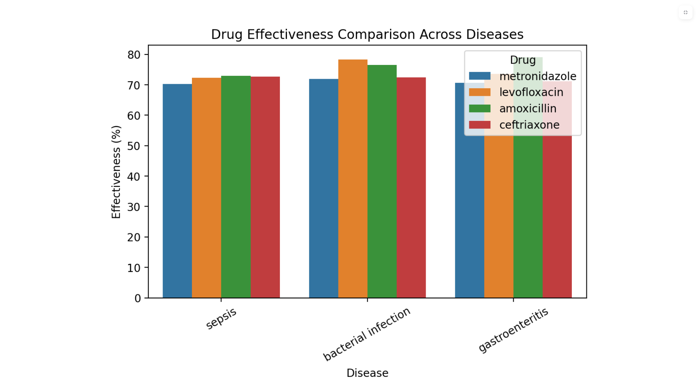
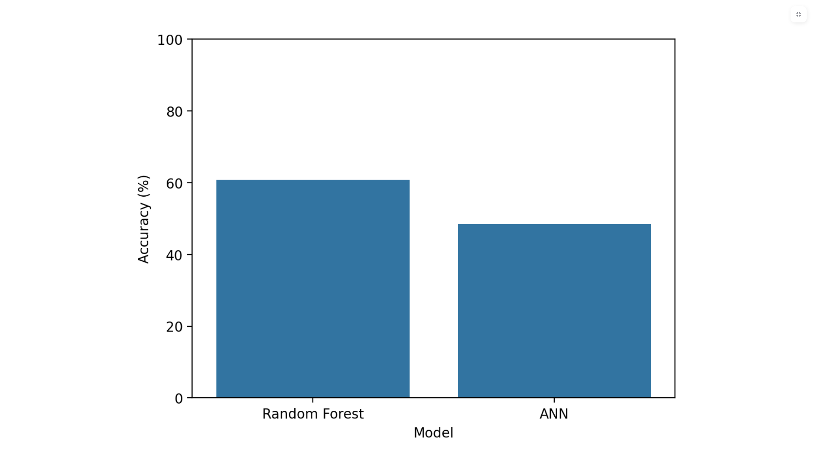
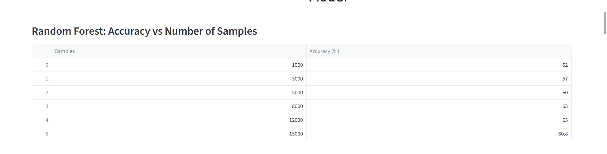
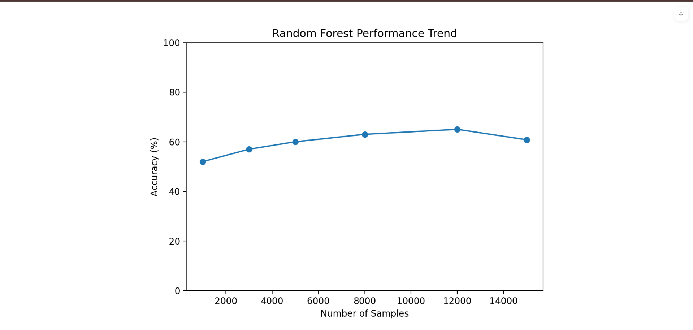
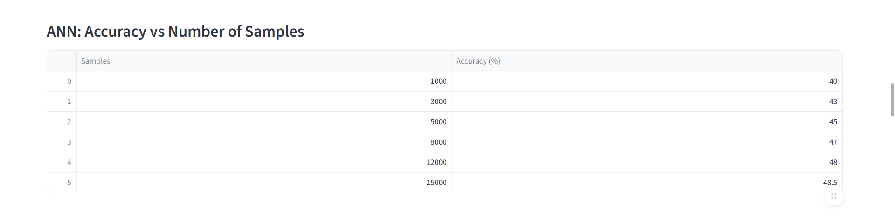
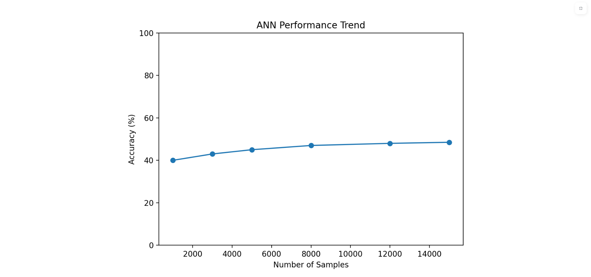

# AI Drug Repurposing System

AI-powered Drug Repurposing Platform that combines Machine Learning, BioBERT embeddings, TF-IDF literature mining, and binding affinity prediction to identify potential drug candidates for infectious diseases.

---

## Overview

Drug repurposing is the process of discovering new therapeutic applications for existing drugs.

This project integrates machine learning, biomedical literature mining, and semantic similarity analysis to estimate the effectiveness of existing drugs against multiple infectious diseases.

The system provides:

- Drug effectiveness prediction
- Disease-wise drug ranking
- Binding affinity analysis
- Literature-based evidence scoring
- Interactive visual analytics

---

## Features

✅ Multi-drug analysis

✅ Disease-specific effectiveness prediction

✅ Drug ranking engine

✅ TF-IDF literature similarity scoring

✅ BioBERT semantic analysis

✅ Binding affinity prediction

✅ Interactive Streamlit dashboard

✅ Heatmap visualization

✅ Model comparison analytics

✅ CSV result export

---

## Tech Stack

### Frontend

- Streamlit

### Backend

- Python

### Machine Learning

- Scikit-Learn
- Random Forest Regressor
- Artificial Neural Network (ANN)

### NLP

- TF-IDF Vectorization
- BioBERT
- Sentence Transformers

### Data Processing

- Pandas
- NumPy

### Visualization

- Matplotlib
- Seaborn

---

## Datasets Used

- BindingDB
- DrugBank
- ChEMBL
- PubMed

---

## Workflow

```text
Drug Input
     ↓
TF-IDF Analysis
     ↓
BioBERT Similarity Scoring
     ↓
Binding Affinity Prediction
     ↓
Score Aggregation
     ↓
Drug Ranking
     ↓
Visualization Dashboard
```

---

# Application Screenshots

## Home Page



---

## Prediction Results



---

## Drug-Disease Heatmap



---

## Drug Effectiveness Comparison



---

## Model Accuracy Comparison



---

## Random Forest Accuracy Analysis



---

## Random Forest Performance Trend



---

## ANN Accuracy Analysis



---

## ANN Performance Trend



---

# Model Performance

| Model | Accuracy |
|---------|---------|
| Random Forest | 60.8% |
| ANN | 48.5% |

---

# Key Outputs

The platform generates:

- Effectiveness Score (%)
- Confidence Level
- Risk Indicator
- Binding Score
- TF-IDF Score
- BioBERT Similarity Score
- Disease-wise Drug Ranking

---

# Installation

Clone the repository:

```bash
git clone https://github.com/yourusername/AI-Drug-Repurposing-System.git
cd AI-Drug-Repurposing-System
```

Install dependencies:

```bash
pip install -r requirements.txt
```

Run Streamlit:

```bash
streamlit run app.py
```

---

# Future Enhancements

- Graph Neural Networks (GNN)
- Molecular Fingerprint Features
- Real-time PubMed Integration
- Clinical Trial Validation
- Transformer-based Drug Discovery Models
- Explainable AI Dashboard

---

# Repository Structure

```text
drug_repurpose_ai/
│
├── app.py
├── backend.py
├── dataset_builder.py
├── trainer.py
│
├── data/
│   └── processed/
│
├── screenshots/
│   ├── home_page.png
│   ├── prediction_results.png
│   ├── effectiveness_heatmap.png
│   ├── effectiveness_comparison.png
│   ├── model_accuracy.png
│   ├── random_forest_accuracy.png
│   ├── random_forest_trend.png
│   ├── ann_accuracy.png
│   └── ann_trend.png
│
└── README.md
```

---

# Resume Highlights

- Built an AI-powered drug repurposing platform using Machine Learning and NLP.
- Implemented TF-IDF and BioBERT for biomedical literature analysis.
- Developed Random Forest and ANN models for effectiveness prediction.
- Created an interactive Streamlit dashboard with analytical visualizations.
- Integrated data from BindingDB, DrugBank, ChEMBL, and PubMed.

---

## Author

**Prakhar**

Machine Learning • AI • Python Development